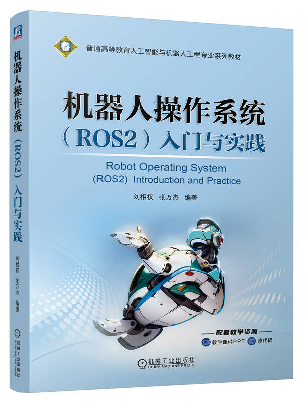
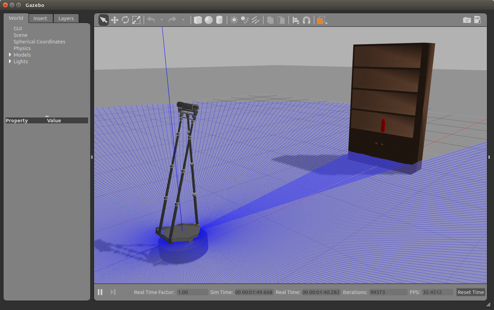
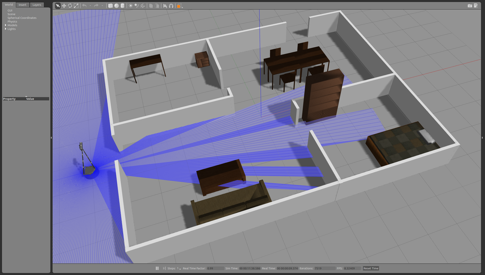
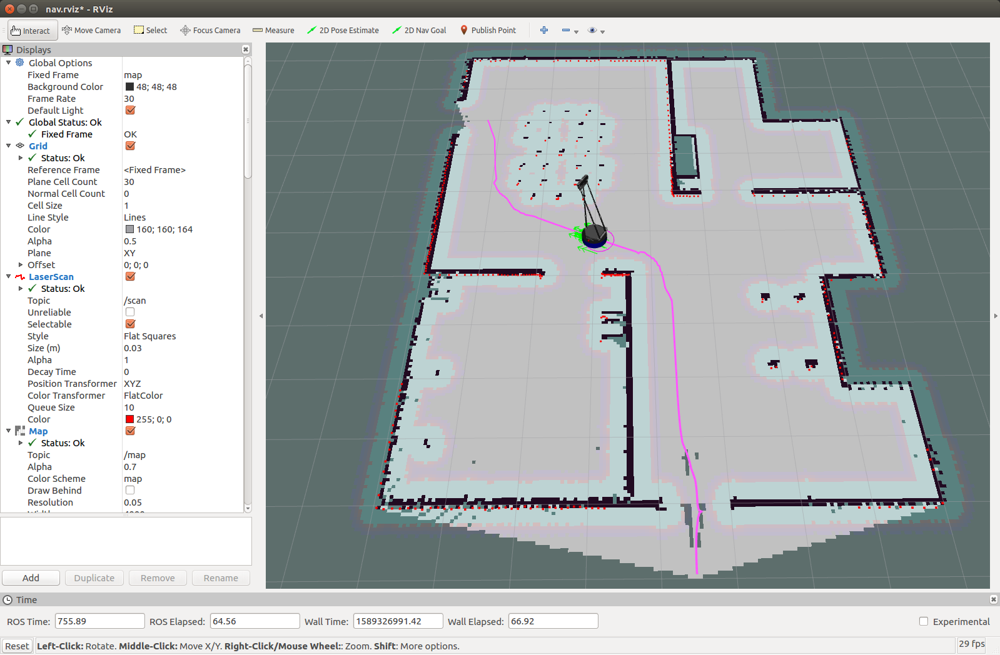

# WPR系列机器人ROS2仿真工具

## 介绍课程
Bilibili: [机器人操作系统 ROS2 入门教材](https://www.bilibili.com/video/BV1oz421v7tB)  
Youtube: [机器人操作系统 ROS2 入门教材](https://www.youtube.com/watch?v=j0foOvBqQTc)

## 配套教材书籍
《机器人操作系统（ROS2）入门与实践》  

淘宝链接：[《机器人操作系统（ROS2）入门与实践》](https://world.taobao.com/item/820988259242.htm)

## 系统版本

- ROS2 Humble (Ubuntu 22.04)

## 使用说明

### 一、 启智ROS机器人
1. 获取源码:
```
cd ~/ros2_ws/src/
git clone https://github.com/6-robot/wpr_simulation2.git
```
2. 安装依赖项:  
ROS2 Humble (Ubuntu 22.04)
```
cd ~/ros2_ws/src/wpr_simulation2/scripts
./install_for_humble.sh
```
3. 编译
```
cd ~/ros2_ws
colcon build --symlink-install
```

简单场景:
```
ros2 launch wpr_simulation2 wpb_simple.launch.py 
```


SLAM环境地图创建:
```
ros2 launch wpr_simulation2 slam.launch.py 
ros2 run rqt_robot_steering rqt_robot_steering 
```


Navigation导航:
```
ros2 launch wpr_simulation2 navigation.launch.py 
```

